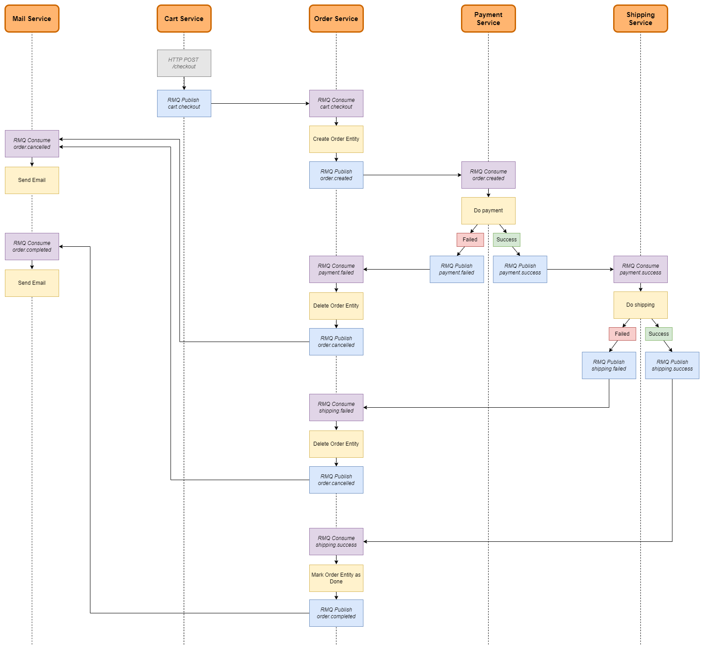

# Minishop backend

Microservice-based webshop backend.

## 🚀 Tech stack
- RabbitMQ
- SAGA Choreography pattern
- Microservice apps in NodeJS, PHP, Python and Java

## 🎯 Motivation
I created this project to dive into the microservice patterns and RabbitMQ best practices. The goal was to implement a webshop backend with only mock functionality and in-memory databases, focusing on the SAGA Choreography pattern and RabbitMQ configurations in different programming languages.

## 💡 Features
- RabbitMQ communication between microservices
- Microservices:
    - Cart service:
        - Stack: NodeJS, ExpressJS
        - Functionality: Receives `POST /checkout` request
    - Order service:
        - Stack: NodeJS, NestJS
        - Functionality: Creates, completes and cancels orders
    - Payment service:
        - Stack: PHP, Laravel
        - Functionality: Makes payments
    - Shipping service:
        - Stack: Python
        - Functionality: Makes shippings
    - Mail service:
        - Stack: Java, Spring Boot
        - Functionality: Sends emails

 

---

 

## App workflow
### Microservice setup

### Exchanges
| name | type
| -- | --
| carts | topic
| orders | topic
| payments | topic
| shippings | topic
| emails | topic

### Queue bindings
| exchange | routing key | name
| -- | -- | --
| carts | cart.checkout | orders.create-order
| orders | order.created | payments.make-payment
| orders | order.completed | emails.send-order-completed-notification
| orders | order.cancelled | emails.send-order-cancelled-notification
| payments | payment.success | shippings.create-shipping
| payments | payment.failed | orders.cancel-order
| payments | payment.failed | emails.send-payment-failed-notification
| shippings | shipping.success | orders.complete-order
| shippings | shipping.failed | orders.cancel-order
| shippings | shipping.failed | payments.cancel-payment
| shippings | shipping.failed | emails.send-shipping-failed-notification

## Test
### Payment
| card number | result
| -- | --
| `3232323232323232` | Payment will be failed immediately
| `4242424242424242` | Payment will be failed with 3 second delay
| `5252525252525252` | Payment will succeed with 3 second delay
| _Any other card number_ | Payment will succeed immediately
